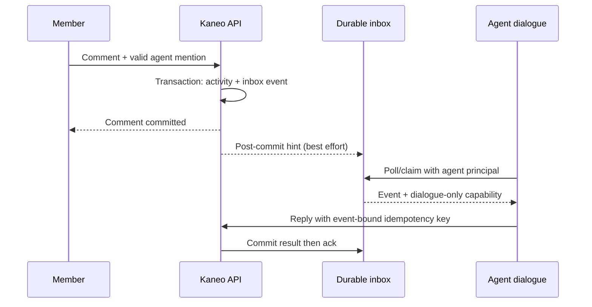
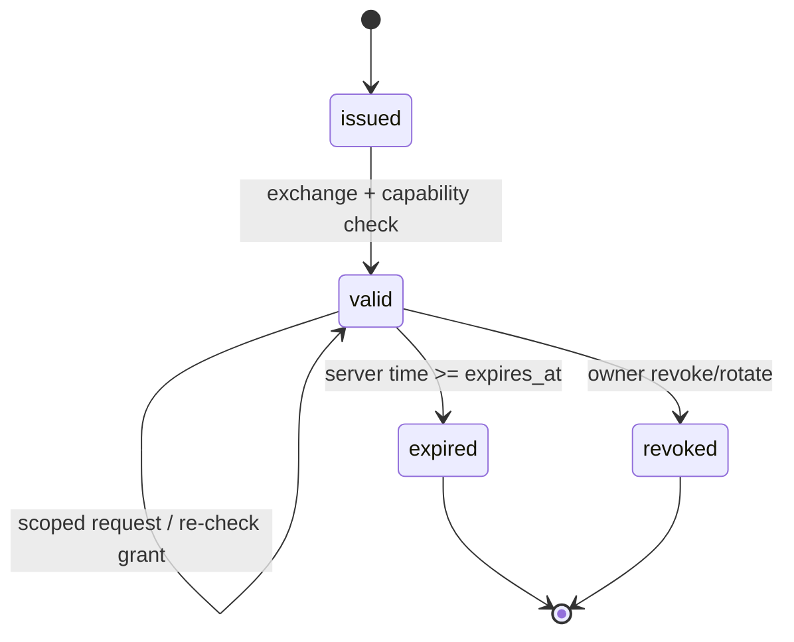

# Spec: Kaneo Remote Agent Team

## Context Snapshot

- Project / module: Kaneo production + native Pi laptop/ProDesk agent workflow.
- Production: `https://kaneo.quoc.app`.
- Kaneo source: `D:/pcloud/workspace/code/kaneo`, pnpm workspace, Node >=20.19, pnpm 10.32.1.
- Agent-side source: `D:/pcloud/workspace/code/python/app_presets/pi/extensions/kaneo-mcp/`, `D:/pcloud/workspace/code/python/app_presets/home_server/projects/kaneo/`, and `D:/pcloud/workspace/code/ai/pi-telegram-bridge/src/kaneo/`.
- Current behavior:
  - Kaneo GitHub integration stores one `owner/repository` mapping per project and syncs tasks with GitHub Issues.
  - Project #2 is connected to `nguyendinhquocx/kaneo`; GitHub App installation and repository verification PASS.
  - Native Pi can read/write Kaneo through MCP, but task data does not yet resolve a local checkout, host path, branch, scope, worker lease, PR, or parent review state.
  - Existing `git_guard.py` supports guarded status/fetch/pull/branch/commit/push, but it is not automatically invoked by native Pi task execution.
  - Existing `agent-contract.md` and TelePi dispatcher contain a partial task envelope/lease/branch contract, but native laptop and ProDesk Pi identities do not yet share a durable parent/worker execution flow.
  - Mention pipeline currently stops at a `task_mention` notification row plus user-targeted `notification.created` WebSocket broadcast; no durable agent inbox, offline retry/ack, or Pi runtime listener is wired.
  - The current anonymous route is `/public-project/:projectId`; API checks project `isPublic`, and the web route/task modal are read-only. There is no opaque share token, guest actor, or anonymous mutation authorization.
- Desired behavior: a Pi parent or worker on laptop/ProDesk can enter through Kaneo, read project execution context and task/spec, resolve the correct local checkout, create an isolated task branch, implement/test/push, and leave durable evidence for another Pi parent to review and merge without sharing a session.
- Relevant files to read before implementation:
  - `apps/api/src/github-integration/controllers/create-github-integration.ts` — current repo mapping and duplicate-repository guard.
  - `apps/api/src/github-integration/index.ts` — current GitHub integration routes and permissions.
  - `apps/api/src/plugins/github/events/` and `apps/api/src/plugins/github/webhooks/` — Issue synchronization behavior.
  - `apps/api/src/database/schema.ts` — integration, task, and external-link persistence patterns.
  - `apps/api/src/mcp/tools.ts` — MCP tool exposure pattern.
  - `apps/web/src/components/project/github-integration-settings.tsx` — current project integration UX.
  - `D:/pcloud/workspace/code/python/app_presets/home_server/projects/kaneo/agent-contract.md` — existing task envelope and lifecycle rules.
  - `D:/pcloud/workspace/code/python/app_presets/home_server/projects/kaneo/github/git_guard.py` — existing Git safety boundary.
  - `D:/pcloud/workspace/code/python/app_presets/pi/extensions/kaneo-mcp/tools.ts` — native Pi Kaneo tool contract.
  - `D:/pcloud/workspace/code/ai/pi-telegram-bridge/src/kaneo/dispatcher.ts` — existing lease/branch/evidence pattern; reuse ideas, do not silently couple native Pi to TelePi.
- Existing constraints:
  - Laptop is canonical source; ProDesk is an execution node.
  - No secret, token, private key, credential, or local absolute path containing sensitive data goes into Kaneo task text, Git, comments, or logs.
  - Git operations must use host-local credential helpers and a source-owned allowlist/guard.
  - Protected branches, force-push, destructive Git operations, production deploy, and automatic merge require separate gates.
  - Production release remains digest-pinned and must use the existing source-owned release lane.
  - The current GitHub App has Issues write, Contents read, Metadata read, and Pull requests read; it is not currently a code-push or PR-merge credential.

## Objective

Tạo một lớp `Remote Agent Team` cho Kaneo: Kaneo giữ context và trạng thái bền, GitHub giữ code/branch/PR, còn Pi parent/worker làm việc độc lập trên laptop hoặc ProDesk.

Thành công nghĩa là:

- Mày cấu hình project một lần; không phải lặp lại repo/path/base branch trong từng task.
- Một Pi vào task có thể biết repo logic, checkout profile của host, spec/docs, base branch, scope và lệnh verify được phép.
- Worker claim task độc quyền, tạo branch riêng, sửa/test/commit/push và ghi evidence.
- Parent khác session đọc được toàn bộ state, diff, commit, PR và test evidence; có thể review/merge theo quyền được cấp.
- Restart, đổi máy hoặc mất session không làm mất trạng thái; task tiếp tục từ Kaneo chứ không phụ thuộc transcript cũ.
- Nếu thiếu checkout, credential, scope, lease hoặc verify thì task chuyển `blocked` rõ ràng, không đoán mò và không tự sửa protected branch.

## Rollout boundary

- `MVP-A` là Remote Agent Team core: manifest, host binding, run/lease/fencing, Git guard, parent evidence/review và manual PR/merge gate; không guest write.
- `MVP-B` là authenticated member mention tới agent dialogue-only: durable inbox, offline retry/ack, read context và reply; không shell/Git/claim từ mention.
- `MVP-C` là share link guest `read` + `comment` trên route/token/session riêng; canary, rate-limit, audit, no-store và revoke phải PASS trước.
- `create_task`, `change_status`, `mention_agents` và `github_issue_sync` từ guest không thuộc first activation; mỗi capability mở sau bằng flag, matrix, telemetry và rollback riêng.

## Scope

### In

- Project execution manifest tách khỏi GitHub Issue-sync config.
- Host-local repo binding cho `pi-laptop` và `pi-prodesk`.
- Durable task execution run, lease, worker/parent identity, branch, commit, PR và evidence.
- Native Pi MCP/tools cho đọc context, claim, heartbeat, report, handoff và resume.
- Git guard flow: clean checkout, fetch, branch, scope, commit, push.
- Parent review flow: đọc diff/evidence, approve/reject, tạo/cập nhật PR và merge theo gate.
- Kaneo UI cho cấu hình execution manifest và xem execution state trên task.
- API/MCP/unit/integration/fixture smoke để bắt race, scope escape, branch sai, credential thiếu và resume.
- Compatibility với GitHub Issue synchronization hiện tại.
- Agent mention delivery: thành viên có thể tag `pi-laptop` hoặc `pi-prodesk` trong comment để tạo notification bền và inbox event cho đúng runtime.
- Guest collaboration link cho điện thoại/Firefox Focus với capability rõ ràng, không cần đăng nhập hoặc cookie lâu dài.

### Out

- Không biến Kaneo thành CI/CD hoặc sandbox tuyệt đối; Pi vẫn là Direction A full shell trust.
- Không tự clone/provision repo trên host trong MVP; host phải có checkout profile đã được đăng ký.
- Không đưa secret hoặc Git credential vào Kaneo.
- Không nhận arbitrary shell command từ task/card; verification dùng profile/source-owned command allowlist.
- Không tự deploy production sau merge.
- Không auto-merge `main` mặc định; MVP mặc định tạo PR và chờ parent/human gate.
- Không hỗ trợ một task đồng thời sửa nhiều repo hoặc nhiều Kaneo project.
- Không thay thế TelePi; chỉ tái sử dụng contract hợp lý và giữ identity/lease boundary riêng.
- Không tự nâng quyền GitHub App trong scope này; Contents/Pull requests write là open decision riêng.
- Không cấp toàn bộ quyền account/admin cho bất kỳ bearer link nào; guest link chỉ là collaboration grant có scope, expiry và revoke.
- Không coi chuỗi `@tên` trong text là authorization; mention hợp lệ phải là entity tag đã được editor/API serialize và resolve tới member thật.
- Không bật guest `create_task`, `change_status`, `mention_agents` hoặc external Issue sync trong first activation; các capability này phải mở riêng sau canary.

## Addendum: agent mention và guest collaboration

### Agent mention

- Mention hiện tại trong Kaneo được serialize thành `<kaneo-mention id="...">`; API phải resolve ID trước mutation tới user đang là member của workspace và agent policy đang active, không tin username tự nhập.
- Khi comment hợp lệ có mention agent, một transaction PostgreSQL phải ghi activity/comment và `agent_inbox_event` trong cùng DB transaction; WebSocket/notification delivery chỉ là side effect sau commit, không phải nguồn bền.
- `agent_inbox_event` độc lập với notification preference: preference chỉ tắt email/ntfy/Gotify/webhook hoặc push hint; không được ngăn row inbox/audit được commit.
- Event tối thiểu có `eventId`, `recipientAgentId`, `taskId`, `commentId`, `payloadVersion`, `capabilitySnapshot`, `createdAt`, `availableAt`, `attemptCount`, `state`, `claimedBy`, `claimedAt`, `ackedAt`, `lastError` và `resultActivityId`; unique `(commentId, recipientAgentId)`. `capabilitySnapshot` là snapshot quyền dialogue/reply của agent tại thời điểm mention, không phải guest capability và không tự mở quyền execution.
- Nếu process chết sau commit thì agent poll vẫn đọc event; nếu publish sau commit thất bại thì chỉ mất realtime hint, không mất work. Outbox dùng cho side effect external, không dùng dual-write không có transaction.
- State machine inbox là `pending → claimed/processing → acked`; claim có `visibilityTimeoutAt`, lỗi/timeout chuyển `retry`, quá ngưỡng chuyển `dead_letter`; ack chỉ sau khi reply/run result và idempotency record đã ghi bền.
- Agent principal là service identity bị giới hạn scope, có thể hiển thị như member để được tag nhưng credential không phải normal member credential. Scope tối thiểu tách `agent:read`, `agent:comment`, `run:claim`, `run:heartbeat`, `run:report`.
- Host identity không nhận từ body kiểu string client tự khai; server lấy từ credential/enrollment binding. Git/code mutation phải cần run capability gắn với `agentId + hostId + taskId + leaseEpoch + scope`.
- Mention handler chạy ở profile `dialogue-only`: không expose shell, Git, credential, host filesystem write, claim/lease/run mutation, PR hoặc merge tools. Không có task run và lease hợp lệ thì agent chỉ reply; guest mention không bao giờ tự tạo execution run.
- Mention chỉ là yêu cầu đọc/đối thoại mặc định. “Intent rõ” là policy runtime, còn hard gate không có run/lease là điều kiện test deterministic; agent không tự chạy shell hoặc tự claim task ngoài policy.
- Agent reply dùng `Idempotency-Key` chứa event ID và body hash; cùng key khác body trả conflict, cùng key cùng body trả result cũ. Duplicate inbox delivery không tạo duplicate comment/run.
- ID mention không tồn tại hoặc không thuộc workspace bị reject `400` trước khi insert activity; không có lỗi FK sau khi comment đã commit và không buộc client retry tạo comment trùng.
- Notification preference có thể tắt delivery channel nhưng không làm mất inbox/audit; `notification.created` WebSocket chỉ là hint, consumer phải poll durable event.

### Guest collaboration link

- Giữ `/public-project/:projectId` là anonymous read-only; không biến cờ `isPublic` thành quyền ghi và không gắn share grant vào workspace middleware hiện tại.
- Share grant dùng route riêng `/share/<public-locator>#<bootstrap-secret>`; locator không phải project ID. Secret là CSPRNG ít nhất 128-bit effective entropy (khuyến nghị 256-bit), raw secret chỉ xuất hiện lúc create/rotate, server lưu keyed digest/hash có `tokenVersion`, default expiry và max expiry, revoke và lineage rotate.
- Fragment không đi trong HTTP request; frontend POST `{locator, secret}` tới `/api/share/exchange` cùng origin, nhận short-lived first-party `HttpOnly; Secure; SameSite=Strict` guest session cookie và CSRF challenge token. Không dùng query/path raw secret, không dùng persistent/third-party cookie.
- Sau exchange frontend dùng `history.replaceState` xóa fragment khỏi address bar/history; refresh dùng guest cookie còn hạn, mở lại share URL sẽ exchange fragment mới. Session TTL có max rõ ràng (MVP không quá 15 phút), revoke lookup server-side.
- Guest GET/mutation đều `Cache-Control: no-store`; mutation chỉ `application/json`, CORS default deny, `Origin` exact + `Sec-Fetch-Site` same-origin/none + `X-Kaneo-Guest-CSRF` challenge. `Referrer-Policy: no-referrer`; token/secret không nằm trong HTML, analytics, error, proxy/access log hay telemetry.
- Vì secret nằm ở fragment, Caddy chỉ thấy locator và endpoint exchange, không thấy bearer secret; rollout phải kiểm tra access log thật sau exchange/mutation.
- Guest middleware riêng giải mã session cookie, lookup grant hiện tại và đặt actor `{ type: "guest", grantId, guestActorId, scope, capabilities }`; mọi request re-check expiry/revoke/capability server-side, không cache quyền sau revoke.
- `X-Kaneo-Guest-CSRF` chống accidental cross-site mutation; `Idempotency-Key` + body hash chống retry duplicate, không gọi đó là anti-replay. Holder có bearer vẫn có thể replay trong TTL; revoke/expiry là biện pháp thu hồi.
- Capability là tuple `(action, resourceScope, ownership/transitionConstraints)`, không chỉ enum: `read`, `comment`, `create_task`, `edit_guest_content`, `change_status`, `mention_agents`, `github_issue_sync`.
- Owner cấp capability riêng, mặc định link mới chỉ `read`, phase C chỉ mở `comment` có feature flag. `edit_guest_content` mặc định chỉ content do cùng `grantId` tạo; shared bearer link không có strong person identity.
- `change_status` project-scope chỉ được các transition policy cho phép, không tự chuyển `done`; task-scope không đổi task ngoài scope. `mention_agents` có agent allowlist, quota/cooldown và không tạo execution run.
- Guest actor không giả member: `activity.userId` nullable, `actorType=guest`, `actorGrantId` và optional display name; guest content ownership theo `grantId` vì người có cùng bearer link không có danh tính cá nhân mạnh.
- Guest không được mặc định sửa/xóa content của member, quản lý member, đổi visibility, đọc notification riêng, cấu hình GitHub/Telegram, lấy secret, push code, PR hoặc merge.
- Capability matrix phải chặn side effect gián tiếp: guest comment/create task/status không trigger GitHub Issue sync hoặc agent workload mặc định; `github_issue_sync` và `mention_agents` là capability riêng, quota riêng, feature flag riêng.
- Share grant có layered rate limit theo grant + IP/subnet coarse bucket + project + operation; `create_task` chặt hơn `comment`, `mention_agents` chặt nhất. Audit lưu grant fingerprint, guest session/actor, capability, target, request/idempotency ID, result, timestamp và network metadata đã redacted; audit sống qua revoke.
- Có nút revoke/rotate; rotate tạo grant lineage mới và invalidate token cũ ngay. Link là transferable bearer authority tới khi hết hạn/revoke, không được quảng cáo là identity cá nhân.
- “Đầy đủ chức năng” trong MVP nghĩa là collaboration đã được cấp quyền trên task/project; không nghĩa là anonymous user có toàn bộ quyền của account đăng nhập. `create_task`, `change_status`, `mention_agents` chỉ mở sau khi phase C có evidence.

### Task 8: Mention router và guest share grant

- Rollout phases:
  - `MVP-A`: Task 1–7 execution core, lease fencing và parent/manual merge gate; chưa bật guest mutation.
  - `MVP-B`: authenticated member → durable agent inbox → dialogue-only read/reply; chưa cho guest trigger agent và chưa cho mention tự claim/code mutation.
  - `MVP-C`: guest share `read` + `comment` trên route riêng, feature flag và canary; `create_task`, `change_status`, `mention_agents`, `github_issue_sync` giữ disabled mặc định.
  - Phase sau: mở từng capability bằng policy/telemetry/rollback riêng, không mở cả cụm một lần.
- Acceptance:
  - Comment + valid agent inbox row commit atomic; preference tắt chỉ tắt delivery channel, không mất inbox.
  - Inbox delivery là at-least-once; state `pending/claimed/processing/retry/acked/dead_letter`, recipient-only ack, visibility timeout, max attempts, server dedupe và result binding được ghi rõ.
  - Claim/reclaim cấp `leaseEpoch`/fencing token; mọi heartbeat/report/state transition và bước trước commit/push compare-and-swap với current lease, stale worker fail-closed.
  - Agent principal không gọi được normal privileged member mutation ngoài scope; dialogue-only handler không expose shell/Git/credential/filesystem/claim/PR/merge tools. Escalation sang execution là authorization transition riêng qua Start worker/claim + run capability.
  - Public read-only route không ghi được; `/share/*` là namespace riêng, guest actor/capability middleware không bypass workspace/admin route.
  - Share exchange dùng fragment bootstrap + short-lived first-party session cookie/CSRF header; token sai, hết hạn, revoked, sai locator/scope hoặc thiếu capability đều fail-closed; GET/mutation no-store và secret không vào edge log.
  - Guest content không tạo external GitHub/agent side effect nếu không có capability riêng; audit/rate-limit/idempotency luôn ghi đúng.
  - Task-scope grant chỉ trả task + activities/assets được phép; project-scope mới trả board/project data; guest realtime dùng optimistic update + refetch, không phụ thuộc user WebSocket.
  - Mobile/Firefox Focus target cụ thể PASS (Android/iOS version được ghi trong rollout), không cần login/persistent hoặc third-party cookie; refresh trong cùng link exchange lại được.
- Files:
  - `apps/api/src/agent-inbox/` — schema/controller poll, claim, ack, retry, dead-letter.
  - `apps/api/src/share-grant/` — grant lifecycle, fragment exchange, session/capability middleware, rate-limit/audit/idempotency.
  - `apps/api/src/database/schema.ts`, `apps/api/drizzle/` — tables, constraints, fresh/upgrade migration.
  - `apps/api/src/activity/controllers/create-comment.ts`, `apps/api/src/activity/index.ts` — transaction, valid mention resolution và guest route boundary.
  - `apps/api/src/notification/controllers/create-notification.ts`, `apps/api/src/ws/index.ts` — tách inbox khỏi preference-gated delivery/realtime hint.
  - `apps/api/src/index.ts`, `apps/api/src/task/`, `apps/api/src/plugins/github/` — route scope, task mutation và external side-effect gate.
  - `apps/web/src/routes/share.$locator.tsx`, `apps/web/src/components/public-project/comment-section.tsx`, `apps/web/src/hooks/` — share bootstrap, comment UI, optimistic update/refetch.
  - `D:/pcloud/workspace/code/python/app_presets/home_server/projects/kaneo/proxy/Caddyfile` — verify fragment secret không vào edge access log.
- Verify:
  - Unit: mention workspace/member/agent validation, event dedupe, state machine, lease fencing, token digest/version, capability/object matrix, Origin/Fetch Metadata, idempotency body hash.
  - Integration: transaction rollback không để comment không có inbox; crash-before/after dispatch, offline poll, two-runtime claim/ack, out-of-order ack, stale lease fence, agent credential ordinary-member bypass.
  - Guest matrix: mọi capability × mọi mutation route, task/project scope, revoke/rotate race, expiry clock boundary, same key/different body, rate limit layered, audit sau revoke, external GitHub/agent side-effect denied.
  - Browser/edge: 320px + target Firefox Focus, no horizontal overflow, public/share GET cache isolation, raw secret không có trong URL request-target/access log/error/DOM analytics; guest realtime không đòi WebSocket.
  - Adversarial: malicious member/guest mention cố gọi shell/Git/claim; handler phải không có tool và server cũng deny; token không leak trong proxy/error/telemetry.
  - Regression: notification types cũ (`task_comment`, status, assignment) vẫn respect preference/delivery và GitHub Issue sync member-originated không đổi.
- Risk: T4, vì đây là nhiều trust boundary; chỉ bật từng phase sau canary và có kill switch.

## Security contract và schema invariants

### Actor matrix

| Actor | Authentication | Được đọc | Được comment | Được claim/run | Được Git/PR/merge |
| --- | --- | --- | --- | --- | --- |
| Member | session/API của member | theo workspace permission | theo task permission | chỉ qua parent/worker policy | không mặc định |
| Agent dialogue | service principal + runtime binding | context được policy cho phép | reply qua `agent:comment` | không | không |
| Agent worker | service principal + host binding + active run lease | context/run | evidence theo run | `run:claim/heartbeat/report` | chỉ branch/scope qua run capability |
| Guest | short-lived share session | grant scope | `comment` nếu được cấp | không | không |
| Parent/human | session + project policy | task/run/evidence | review/evidence | approve/reject theo policy | human merge gate mặc định |

Agent không được masquerade thành normal member để đi qua legacy mutation API. Server phải kiểm tra principal, project, task, run, host, scope và current lease ở từng execution mutation; request body không được tự khai agent/host để thay thế binding. Agent principal bị deny legacy task update/status/assignee, activity comment/delete, project settings, notification mutation và GitHub/merge routes; chỉ allow các agent/inbox/run endpoint đã liệt kê.

### Atomic delivery và idempotency

- Comment transaction resolve mention trước insert; sau đó ghi activity, durable `agent_inbox_event` và idempotency record trong cùng DB transaction. Nếu transaction rollback thì không có comment/inbox nửa vời.
- Delivery contract là at-least-once: dispatcher claim event với visibility timeout, retry theo backoff, max attempts và dead-letter; event không bị xóa khi consumer offline.
- Dedupe key server sinh từ `sourceCommentId + recipientAgentId + eventType`; unique constraint chặn duplicate event. Reply/run result bind `inboxEventId`; cùng `Idempotency-Key` + cùng body trả kết quả cũ, khác body trả `409`.
- Ack chỉ sau khi result activity/run evidence và idempotency record đã commit; ack bởi recipient principal đúng, không dùng `notification.isRead` thay cho inbox ack.
- `notification.created`/WebSocket publish và email/push là post-commit delivery hint; mất hint không mất inbox. Preference chỉ điều khiển channel delivery, không điều khiển durable agent work.

### Bảng và invariant bắt buộc

- `agent_inbox_event`: `id`, recipient agent, task, nullable source comment reference + immutable payload snapshot, event type, payload version, capability snapshot, state, available/claimed/acked timestamps, attempt count, last error, result activity/run reference; unique source-comment/recipient/event; source deletion dùng `SET NULL`, không cascade mất audit.
- `share_grant`: immutable owner/project-or-task scope, public locator, token digest, token version, capabilities/policy version, created/expiry/revoked timestamps, rotate lineage; token digest unique và revoke có hiệu lực ngay.
- `guest_session`: grant reference, pseudonymous `guestActorId`, session digest, issued/expiry/revoked timestamps, CSRF challenge digest, user-agent/network metadata redacted; không lưu raw token. Exchange cấp cookie + challenge; refresh/session endpoint cấp challenge mới theo cùng session.
- `guest_audit_event`: grant/session fingerprint, actor type, capability, target, request/idempotency ID, result, timestamp và redacted network metadata; revoke/delete grant không cascade xóa audit.
- `idempotency_record`: principal/operation namespace, key, body hash, result reference/status, created/expiry; unique namespace+key và conflict khi hash khác.
- `activity`: giữ `userId` nullable hiện tại cho guest, thêm `actorType=guest`/`actorGrantId` hoặc dùng pattern external actor đã có; comment cũ giữ nguyên, không tạo fake member. FK/cascade phải được kiểm tra cho task/project/member deletion.
- `task_run`/lease: chỉ một current active lease theo policy, `leaseEpoch` monotonically increasing, server time authoritative; run snapshot `manifestVersion`, repo/base/config SHA để integration đổi không retarget active run.
- Manifest/context/inbox/run protocol có version và minimum-compatible runtime; runtime cũ gặp field security-critical không hiểu phải fail-closed.

### Lease fencing và execution profile

- Claim/reclaim phát `leaseEpoch` hoặc fencing token mới. Heartbeat, report, state transition, run capability và pre-commit/pre-push guard đều compare-and-swap với current lease + epoch + server expiry.
- Worker stale vẫn có thể còn local process nhưng không được commit/push/report; nếu không verify được server fence thì guard fail-closed. Retry sau expiry tạo run/branch identity mới theo `runId`, không reuse branch cũ mù.
- Mention handler chạy profile `dialogue-only` với allowlist tool rỗng ngoài read-context/reply-comment; worker profile mới có shell/Git khi task run đã được claim. Comment/prompt không thể mở rộng toolset hoặc capability.
- Escalation từ dialogue sang worker là endpoint/policy transition riêng (`Start worker`/claim), có parent permission, active lease, scope và audit; guest mention không được gọi transition này.

### Capability và external side-effect matrix

| Capability | Kaneo effect | GitHub Issue sync | Agent workload | Default |
| --- | --- | --- | --- | --- |
| `read` | đọc data trong scope | không | không | public/share |
| `comment` | tạo guest activity trong scope | không | không | phase C |
| `create_task` | tạo task trong scope | không, trừ capability riêng | không | disabled |
| `change_status` | chỉ transition policy cho phép | không, trừ capability riêng | không | disabled |
| `mention_agents` | tạo inbox chỉ cho agent allowlist | không | quota + cooldown | disabled |
| `github_issue_sync` | side effect external rõ ràng | có audit/flag riêng | không | disabled |

Execution status/Task status/GitHub Issue state mapping MVP-A: task status/UI và GitHub webhook giữ mapping hiện tại; `task_run`/execution state là state machine riêng. Run `done` chỉ là evidence/review state; parent approve sau merge gate mới được phép chuyển task final. Duplicate webhook/retry dùng delivery idempotency, không tạo state loop, không chiếm lease và không silently retarget active run. Guest-originated status disabled và không sync Issue; external sync về sau cần capability/flag riêng.

### Kill switch và quan sát

Trước canary phải có flag độc lập: `agent_inbox_dispatch_enabled`, `agent_reply_enabled`, `guest_mutation_enabled`, `guest_agent_mentions_enabled`, `git_push_enabled`, `pr_creation_enabled`, `merge_enabled`. Mỗi flag fail-closed và đổi server-side không cần deploy.

Metrics/alerts tối thiểu: inbox depth/oldest unacked/retry/dead-letter/duplicate suppression, stale-fence rejection/lease conflict, active-expired-revoked grants, denied capability/rate-limit hits, guest mutation by operation, agent action by grant/project, cache/access-log secret scan và Git/PR gate failures.

### Boundary diagrams

## Thuật ngữ

- `Project execution manifest`: cấu hình runtime của một Kaneo project: repo logic, base branch, docs, verification profile và agent policy.
- `Host binding`: mapping local của một host từ `owner/repo` tới checkout root; chỉ nằm trong host-local config, không nằm trong Kaneo.
- `Task run`: một lần worker/parent thực hiện task, có identity, lease, branch và evidence riêng.
- `Parent`: agent giữ quyền điều phối, review và quyết định merge; không đồng nghĩa với Pi session đã tạo task.
- `Worker`: agent thực thi implementation trong branch/worktree riêng.
- `Lease`: quyền tạm thời độc quyền trên task/run; hết hạn thì không được tiếp tục mutation.
- `Scope`: các relative path worker được phép sửa; `*` không hợp lệ.
- `Evidence`: commit, PR, files, commands, test results, risks và next action được ghi bền vào Kaneo.
- `Execution profile`: tên profile source-owned cho lệnh verify/build/lint; không phải shell command tùy ý do task truyền vào.
- `Dialogue-only profile`: runtime xử lý mention chỉ có read-context và reply-comment; không có shell/Git/credential/filesystem/claim/lease/PR/merge tool.
- `Agent principal`: service identity có scope và runtime/host binding riêng; không phải normal member credential.
- `Agent inbox event`: work item durable at-least-once cho một recipient agent, khác notification UI và khác comment text.
- `Lease fence`: epoch/token server cấp để stale worker không mutation sau takeover.
- `Share grant`: bearer capability có locator, secret digest, resource scope, expiry, revoke và policy riêng; không phải `isPublic`.
- `Guest session`: first-party HttpOnly session cookie ngắn hạn đổi từ fragment bootstrap, kèm CSRF challenge cho mutation và luôn re-check grant server-side.
- `Merge gate`: điều kiện parent phải pass trước khi merge PR hoặc chuyển task sang `done`.

## Assumptions

1. Một Kaneo project gắn đúng một GitHub repository; quy tắc duplicate repository hiện tại được giữ.
2. Repo đã có trên laptop/ProDesk dưới checkout root được host allowlist xác nhận.
3. Mỗi host có credential Git riêng trong secret helper; credential không đi qua Kaneo.
4. Task phải có acceptance criteria/spec đủ rõ; agent không tự biến một card mơ hồ thành implementation.
5. Base branch mặc định là `main`, nhưng project manifest được phép chọn branch khác không thuộc protected denylist.
6. Branch worker dùng identity của runtime: `pi-laptop/<task-id>-<slug>` hoặc `pi-prodesk/<task-id>-<slug>`.
7. PR creation/push chỉ thực hiện khi host credential có quyền; thiếu quyền thì worker vẫn có thể report branch/commit hoặc chuyển `blocked`, không tự xin secret.
8. Kaneo API là nguồn trạng thái; GitHub là nguồn diff/PR; transcript Pi chỉ là cache, không phải state.
9. Database support PostgreSQL transaction/isolation đủ để comment + inbox + idempotency commit atomic; server clock là nguồn expiry/lease.
10. Manifest, task run, inbox payload và agent runtime có version/capability negotiation; runtime cũ không silently ignore field security-critical.
11. Guest share phase C target phải ghi rõ Firefox Focus Android/iOS version và device matrix trước browser gate; không dùng “equivalent” thay cho target.

## Open Questions

1. MVP dùng host-local Git credential để push/create PR hay cấp `Contents write` + `Pull requests write` cho GitHub App? Khuyến nghị: host-local credential trước, không mở rộng App ngay.
2. Parent có được merge PR tự động sau khi checker PASS không? Khuyến nghị MVP: `parent_reviewed` nhưng human merge gate mặc định; bật auto-merge chỉ bằng project policy rõ.
3. Verification profile nào là baseline đầu tiên cho Kaneo source: `pnpm --filter @kaneo/api test`, `pnpm --filter @kaneo/web typecheck`, build, hay profile theo từng repo?
4. Có cho phép một project có nhiều checkout profile trên cùng host không? Khuyến nghị MVP: một logical repo chỉ một checkout root mỗi host.
5. Có cần UI queue toàn workspace ngay MVP không? Khuyến nghị: chưa; task panel + project settings đủ, queue dashboard làm phase sau.
6. Guest share mặc định chỉ `read` hay `read+comment`? Safe default đã chốt cho rollout: tạo link `read`; phase C mới mở `comment` có flag và canary.
7. Guest có được `mention_agents` không? Safe default đã chốt: tắt; chỉ phase sau bật bằng grant riêng, agent allowlist, quota và không bypass task run/lease/Git gate.
8. Agent mention mơ hồ xử lý thế nào? Safe default: agent chỉ hỏi lại; implementation/code mutation phải có intent rõ và task execution policy, hard gate là dialogue-only không có tool nguy hiểm.
9. Share link scope là project hay task? Safe default: cả hai nhưng endpoint/data filtering phải explicit; task-scope không được trả board/project ngoài scope.
10. Task/GitHub Issue transition mapping đã chốt cho MVP-A: task status/UI và GitHub webhook giữ mapping hiện tại; `task_run`/execution state chỉ là state machine riêng và không tự ghi task status. Parent approve sau merge gate mới được phép chuyển task final; duplicate webhook dùng delivery idempotency và không chiếm lease/retarget run. Guest-originated mutation bị disable và không sync Issue; muốn sync phải capability/flag riêng phase sau.
11. Audit/inbox/dead-letter retention và ai được đọc audit? Phải chốt theo policy; revoke không xóa lineage/audit, raw token/network metadata không được lưu.

## Approach

- Tách `GitHub Issue integration` và `Agent execution` thành hai lớp. GitHub integration tiếp tục lo Issue sync; execution layer lo checkout/branch/worker/parent.
- Lưu project execution config trong bảng/config riêng, không nhét thêm JSON tùy tiện vào integration GitHub hiện tại. Repo owner/name phải được đối chiếu với integration đang active.
- Lưu task run/lease/evidence ở persistence riêng để một task có thể có retry/resume có kiểm soát mà không phá task description hay external-link history.
- Host-local config chỉ chứa logical repo mapping, checkout root, profile và credential reference. Không lưu absolute path hoặc secret vào task/comment.
- Native Pi dùng MCP/tools để đọc context và cập nhật run; local Git mutation đi qua `git_guard.py` hoặc adapter tương đương với cùng contract `repo-root + branch + scope + task-id`.
- Parent không tin worker tự báo thành công: phải đọc diff/stat, trace branch/commit/PR, kiểm tra test evidence và chạy lại gate quan trọng trước khi accept.
- Nếu worker khác host hoặc session, nó nhận context pack từ Kaneo gồm task, manifest, run state, branch, scope, acceptance và dependency output; không cần fork transcript parent.
- Merge order: worker push branch → PR/review → parent verify → merge gate → Kaneo `done`. Xung đột thuộc parent; worker không tự merge nhánh khác.
- Execution state, Kaneo task status và GitHub Issue state có mapping/source-of-transition riêng; webhook retry/duplicate không tự bypass merge gate hoặc tạo state loop.
- Active run snapshot repo/base/manifest/config version; đổi GitHub integration không retarget run đang chạy, mà chuyển run sang reconcile/blocked nếu mismatch.

## Failure States

- `unconfigured`: project chưa có execution manifest hoặc GitHub mapping không khớp.
- `host_unbound`: host chưa map `owner/repo` tới checkout root.
- `credential_blocked`: Git fetch/push/PR thiếu quyền; không retry mù.
- `lease_conflict`: task đã có run active hoặc lease còn hạn.
- `dirty_checkout`: checkout có thay đổi ngoài task; không reset/clean tự động.
- `scope_violation`: diff chạm file ngoài scope hoặc branch không đúng pattern.
- `verify_failed`: test/lint/build bắt buộc fail; giữ branch để chẩn đoán.
- `merge_conflict`: parent phải xử lý conflict; task không tự chuyển `done`.
- `orphaned`: heartbeat hết hạn; không auto-spawn bản sao trước khi reconcile.
- `stale_fence`: worker/inbox consumer dùng lease epoch cũ; mọi mutation bị từ chối và ghi metric.
- `delivery_pending`: inbox event đã commit nhưng chưa claim.
- `delivery_retry`: consumer lỗi hoặc visibility timeout; retry theo backoff/max attempts.
- `delivery_dead_letter`: retry vượt ngưỡng; cần reconcile, không tự spam agent.
- `capability_denied`: principal/guest thiếu scope hoặc object/transition constraint.
- `grant_expired`: server time vượt expiry; không dựa browser clock.
- `grant_revoked`: owner rotate/revoke; request kế tiếp fail ngay cả session cũ.
- `grant_rate_limited`: vượt quota grant/IP/project/operation; audit redacted.

## Task List

### Task 1: Execution contract, schema và lease API

- Acceptance:
  - Có project execution manifest riêng, validate repo phải khớp GitHub integration active.
  - Có task run persistent với state, role, agent, host, branch, scope, base SHA, commit SHA, PR metadata, lease và evidence.
  - Claim/heartbeat/release/report có transaction/idempotency; hai worker claim đồng thời chỉ một thằng thắng.
  - Mỗi claim/reclaim tăng `leaseEpoch`/fencing token; heartbeat/report/pre-commit/pre-push stale fence đều fail-closed.
  - Manifest/run/protocol version được snapshot vào run; active run không bị silently retarget khi repo/integration đổi.
  - Không endpoint nào nhận secret hoặc arbitrary command từ task.
- Reproduce: `pnpm -C "D:/pcloud/workspace/code/kaneo" --filter @kaneo/api test`
- Verify:
  - Unit test validate manifest, branch, scope, ownership và lease expiry.
  - Integration test hai claim đồng thời, retry cùng request ID, worker hết heartbeat và resume.
  - Race test A stale sau expiry/takeover của B: heartbeat/report/commit/push của A bị reject bởi fence.
  - Migration fresh-install và upgrade không mất integration/external-link hiện tại; constraint/index rollback và protocol version được kiểm tra.
- Files:
  - `apps/api/src/database/schema.ts` — pattern: `integrationTable` và `externalLinkTable` với foreign key/index/unique constraint.
  - `apps/api/src/*/index.ts` — pattern: Hono route + workspace/project access middleware.
  - `apps/api/drizzle/` — pattern: migration/journal hiện tại.
  - `apps/api/src/mcp/tools.ts` — pattern: tool schema và input validation.
- Risk: T3, vì đụng schema/API/state.

### Task 2: Project execution manifest và UI cấu hình

- Acceptance:
  - Trong project settings có khu vực `Agent execution`.
  - User chọn base branch, docs/spec references, verification profile và allowed agent identities.
  - UI hiển thị repo GitHub đang link nhưng không cho nhập secret/local absolute path.
  - Manifest sai repo hoặc profile không hợp lệ bị chặn trước khi save.
- Reproduce: `pnpm -C "D:/pcloud/workspace/code/kaneo" --filter @kaneo/web typecheck`
- Verify:
  - Browser test: project chưa cấu hình, cấu hình hợp lệ, repo đổi, manifest mismatch, host profile chưa có.
  - Responsive/accessibility smoke ở layout settings hiện tại.
- Files:
  - `apps/web/src/components/project/github-integration-settings.tsx` — pattern: form/verify/save GitHub integration.
  - `apps/web/src/routes/_layout/_authenticated/dashboard/settings/projects/$projectId/integrations.tsx` — pattern: project settings route.
  - `apps/web/src/fetchers/` và `apps/web/src/hooks/` — pattern: query/mutation envelope.
  - `i18n/en-US.json`, `i18n/vi-VN.json` — pattern: key song ngữ.
- Risk: T2, tăng UI/API surface nhưng không cấp credential.

### Task 3: Host binding và Git guard native Pi

- Acceptance:
  - `pi-laptop` và `pi-prodesk` có host-local repo map fail-closed.
  - Resolver nhận `projectId + logical repo + host identity` và trả checkout root đã allowlist; không đọc path từ task prose.
  - Guard thực hiện status → fetch → branch → edit/test → commit → push; protected branch/force-push/dirty tree/out-of-scope đều bị chặn.
  - Branch chứa task ID, identity và `runId`; retry sau orphan không reuse branch cũ mù; commit message chứa task ID.
  - Trước commit/push guard phải validate current server lease epoch; không verify được fence thì fail-closed.
- Reproduce: `py -3.13 "D:/pcloud/workspace/code/python/app_presets/home_server/projects/kaneo/tests/github_agent_smoke.py"`
- Verify:
  - Disposable bare Git remote test cho fetch/pull/branch/commit/push.
  - Test sai repo root, sai branch, scope `*`, path `..`, dirty checkout, credential fail và stale fence sau takeover.
  - Native laptop và ProDesk smoke bằng branch disposable, không dùng `main` hoặc production deploy.
- Files:
  - `D:/pcloud/workspace/code/python/app_presets/home_server/projects/kaneo/github/git_guard.py` — pattern: fail-closed repo/path/branch/scope guard.
  - `D:/pcloud/workspace/code/python/app_presets/home_server/projects/kaneo/github/README.md` — pattern: allowlist/credential boundary.
  - `D:/pcloud/workspace/code/python/app_presets/pi/extensions/kaneo-mcp/` — pattern: native Pi tool/client/runtime config.
  - `D:/pcloud/workspace/code/ai/pi-telegram-bridge/src/kaneo/git-scope.ts` — pattern: safe relative path/scope validation.
- Risk: T4, vì đụng Git credential/push và cross-machine runtime.

### Task 4: Native Pi worker context pack và lifecycle

- Acceptance:
  - Worker bắt đầu từ task ID có đủ task/spec/manifest/host binding/branch/scope/verify/dependency context.
  - Worker claim task bằng lease, heartbeat định kỳ, report `in_progress`, `in_review`, `blocked` theo evidence contract; `done`/`rejected` chỉ parent review/merge gate được finalization.
  - Worker restart/resume không tạo task run bản sao; lease hết hạn chuyển `orphaned` và cần reconcile.
  - Pi không tự sửa task envelope/lease owner bằng update task thường.
  - Mention handler chạy dialogue-only, không có shell/Git/credential/claim/lease/PR/merge tool; escalation sang worker là transition riêng có authorization.
  - Agent principal/runtime/host binding và allowed scopes được server enforce; không nhận agent/host identity do client tự khai.
- Reproduce: `pnpm -C "D:/pcloud/workspace/code/python" --filter ./app_presets/pi/extensions/kaneo-mcp test` nếu extension có script test; nếu không, chạy typecheck command source-owned của extension và ghi rõ command thực tế trong implementation handoff.
- Verify:
  - Fixture MCP test cho claim/heartbeat/report/retry/resume.
  - Test context pack không chứa API key/private key/credential.
  - Test parent/worker khác session đọc cùng state từ Kaneo.
- Files:
  - `D:/pcloud/workspace/code/python/app_presets/pi/extensions/kaneo-mcp/tools.ts` — pattern: Kaneo tool schema.
  - `D:/pcloud/workspace/code/python/app_presets/pi/extensions/kaneo-mcp/kaneo-client.ts` — pattern: authenticated MCP call/error handling.
  - `D:/pcloud/workspace/code/python/app_presets/home_server/projects/kaneo/agent-contract.md` — pattern: envelope/state/evidence rules.
  - `D:/pcloud/workspace/code/ai/pi-telegram-bridge/src/kaneo/dispatcher.ts` — pattern: lease/heartbeat/branch lifecycle, chỉ tham khảo boundary.
- Risk: T4, vì orchestration state và cross-session authority.

### Task 5: Parent review, PR và merge gate

- Acceptance:
  - Parent lấy được branch/commit/PR/diff/test evidence từ task run.
  - Parent reject được worker report thiếu evidence, diff ngoài scope, test fail hoặc branch sai.
  - Worker chỉ push task branch; protected branch không được push trực tiếp.
  - PR creation/merge chỉ chạy khi host credential/policy cho phép; thiếu quyền chuyển `credential_blocked`, không xin secret trong task.
  - Mặc định merge gate là manual/human; auto-merge là policy riêng chưa bật.
- Reproduce: `py -3.13 "D:/pcloud/workspace/code/python/app_presets/home_server/projects/kaneo/tests/github_agent_smoke.py"`
- Verify:
  - Fixture PR/merge adapter với fake remote hoặc mock GitHub API.
  - Reject matrix: thiếu commit, thiếu test, scope escape, protected branch, conflict, stale lease.
  - Parent cross-branch verify dùng `git diff base...worker-branch`, không tin worker tự báo.
  - Race test stale worker không thể report/push sau lease takeover; GitHub Issue transition mapping không làm task `done` bypass merge gate.
- Files:
  - `D:/pcloud/workspace/code/python/app_presets/home_server/projects/kaneo/agent-contract.md` — pattern: evidence/merge/protected-branch contract.
  - `D:/pcloud/workspace/code/python/app_presets/home_server/projects/kaneo/github/git_guard.py` — pattern: push/protected branch gate.
  - `apps/api/src/plugins/github/` — pattern: Octokit installation access và Issue event adapter.
- Risk: T4, vì merge/code publication và GitHub permissions.

### Task 6: Task execution panel và parent/worker visibility

- Acceptance:
  - Task card hiển thị run state, parent/worker, host, branch, commit, PR, last heartbeat, verify result, blocker và next action.
  - Comment/evidence vẫn đọc được dưới dạng markdown; machine state không phụ thuộc text parsing.
  - User thấy rõ task đang chờ claim, đang chạy, review, blocked hay done.
  - Không thêm dashboard enterprise thừa trong MVP.
- Reproduce: `pnpm -C "D:/pcloud/workspace/code/kaneo" --filter @kaneo/web typecheck`
- Verify:
  - UI smoke cho empty/loading/stale/orphaned/blocked/done.
  - Mobile/responsive check ở task detail và settings.
  - Refresh app hoặc mở session khác vẫn thấy cùng state.
- Files:
  - `apps/web/src/components/task/` — pattern: task detail/comment/activity components.
  - `apps/web/src/routes/_layout/_authenticated/dashboard/` — pattern: task/project route state.
  - `apps/web/src/hooks/` — pattern: query invalidation/realtime update.
- Risk: T2, chủ yếu UI/state rendering.

### Task 7: End-to-end fixture, release và rollout

- Acceptance:
  - Fixture chứng minh flow project manifest → task claim → isolated branch → commit/push → parent verify → PR/merge evidence.
  - Production rollout không làm hỏng GitHub Issue sync hiện tại.
  - Migration backup/rollback evidence tồn tại trước activation.
  - Laptop và ProDesk được verify riêng; không coi một host PASS là parity PASS.
- Reproduce: `pnpm -C "D:/pcloud/workspace/code/kaneo" test`
- Verify:
  - API/web/extension tests PASS.
  - Disposable Git remote E2E PASS.
  - Production canary trên một project/test task, không tự merge production code; Task 8 MVP-B/C canary tách khỏi MVP-A.
  - Health, MCP, GitHub app-info, repository verification và staging/credential redaction PASS.
  - Kill switch/metrics cho inbox, guest mutation, guest mention, Git push, PR và merge được verify trước activation; không chỉ có rollback binary/database.
- Files:
  - `D:/pcloud/workspace/code/python/app_presets/home_server/projects/kaneo/` — pattern: source-owned installer/release/verify lane.
  - `D:/pcloud/workspace/code/python/plans/` — pattern: redacted release evidence.
  - `tests/` trong Kaneo và host bundle — pattern: fixture/runtime smoke.
- Risk: T4, vì release/migration/cross-machine activation.

## User Test Checklist

1. Vào project settings, thấy repo GitHub đã link và cấu hình được execution profile mà không nhập secret/path local.
2. Từ một task có acceptance rõ, bấm/chạy `Start worker`; task hiển thị host, branch và heartbeat.
3. Mở task bằng Pi khác session; Pi thứ hai đọc được cùng spec, branch, evidence và trạng thái.
4. Worker sửa một file trong scope, chạy test, push branch; Kaneo hiển thị commit/PR.
5. Thử worker thứ hai claim cùng task; hệ thống từ chối hoặc hiển thị lease đang giữ.
6. Parent review diff/test, reject một evidence thiếu, sau đó approve đúng run và chuyển task sang `done` theo merge gate.
7. Làm task khi host chưa có checkout hoặc credential; UI phải báo blocker cụ thể, không treo hoặc tự đoán.
8. Refresh/restart Pi rồi mở lại task; state run vẫn còn và không tạo worker bản sao.
9. Member tag `pi-laptop` trong comment; khi runtime offline, event vẫn nằm trong inbox; runtime online đọc, reply đúng identity và không tạo duplicate.
10. Mở public read-only link bằng Firefox Focus không login vẫn xem được; không thể comment/mutate nếu chưa có grant.
11. Mở share link có `comment` hoặc capability được cấp; comment hiện actor guest, không đọc notification riêng và không gọi được admin/Git/merge API.
12. Revoke/expire share link rồi thử refresh và mutation; request bị chặn, token không lộ trong log/URL referrer/analytics.

## Risks

- Lưu path local vào Kaneo sẽ làm manifest không portable và lộ layout máy; host binding phải local-only.
- Cấp GitHub App write quá sớm biến App thành credential code-publication; giữ read-only + host credential trong MVP.
- Parent/worker cùng sửa một checkout sẽ làm mất isolation; bắt buộc clean checkout/worktree và branch ownership.
- Lease chỉ ở memory sẽ chết khi Pi restart; state/lease phải server-side với expiry, server clock và fencing epoch.
- Dùng comment làm database sẽ vỡ khi format đổi; machine state phải ở bảng/API riêng, comment chỉ là evidence view.
- Cho task truyền arbitrary test command là remote code execution qua card; chỉ cho verification profile source-owned.
- Mention/guest content là untrusted prompt input; dialogue-only tool isolation phải mechanically enforce, không chỉ instruction.
- Bearer link vẫn transferable authority; fragment + short-lived session giảm leak nhưng không tạo person identity, revoke/expiry vẫn bắt buộc.
- Guest mutation có thể tạo indirect external/agent workload; default deny và capability matrix phải chặn side effect.
- Atomic transaction/outbox, dedupe, visibility timeout và dead-letter không được thay bằng WebSocket/notification row.
- Auto-merge không có human gate có thể đưa code lỗi vào branch protected; default manual.

## Checkpoints

- Sau Task 1: migration fresh/upgrade, lease race và API permission PASS; chưa làm UI/worker.
- Sau Task 2: project manifest save/load + validation PASS; chưa cho mutation Git.
- Sau Task 3: disposable Git guard PASS trên laptop và ProDesk; chưa dùng production checkout.
- Sau Task 4: native Pi context/lifecycle fixture, REST lease headers, token-redaction, restart reconciliation, lease-loss fencing, guarded fetch/branch và full API integration `11 files / 67 tests` PASS; source commits `69bc286e` và `e9561ad8`; production execution API vẫn chưa deploy (`/api/execution/agents` trả `404`).
- Sau Task 5: worker/parent fixture PASS với branch/lease/fencing/evidence/PR policy; parent review trước rollout.
- Sau MVP-B: member mention offline/restart, dialogue-only malicious prompt, inbox crash/retry/ack/dead-letter và agent principal negative matrix PASS; guest vẫn disabled.
- Sau MVP-C: guest read/comment fragment exchange, task/project scope, revoke/cache/log/rate-limit/audit/CSRF/idempotency matrix PASS; `create_task/change_status/mention_agents` vẫn disabled.
- Trước production activation: API/web/extension verify, backup/release plan, canary project, cross-machine smoke, feature flags/metrics và rollback evidence PASS.

## External Review Brief

### Reviewer cần phán

- Execution manifest có đủ để agent context rỗng tìm đúng repo/spec/checkout mà không lưu secret không?
- Task run/lease có chặn duplicate worker và resume sau restart thật không?
- Git scope/branch/push/PR/merge gate có chặn protected branch, dirty checkout, out-of-scope và credential leak không?
- Parent có evidence độc lập hay chỉ tin worker tự báo PASS?
- Schema/migration có giữ nguyên GitHub Issue sync và external links cũ không?
- MVP có đang biến thành CI/CD/sandbox/agent platform quá sớm không?
- Mention có đi tới durable inbox khi agent offline không, hay chỉ tạo row/WebSocket event dễ mất?
- Guest share có phân biệt read-only public với bearer grant ghi dữ liệu, có revoke/expiry/scope/rate-limit/audit và fail-closed không?
- “Không cần login” có vô tình biến link bị lộ thành quyền sửa/xóa/admin hoặc trigger agent/Git mutation không?
- Mention handler có thực sự dialogue-only và agent credential có bị legacy member API bypass không?
- Inbox có atomic transaction, at-least-once state machine, recipient-only ack, fencing/idempotency và dead-letter không?
- Lease stale worker, repo/config retarget và GitHub Issue transition mapping có fail-closed không?
- Guest capability có object/ownership/transition constraint, external side-effect matrix, no-store GET/cache revoke và layered abuse telemetry không?
- Schema/migration có giữ audit sau revoke/delete, nullable guest actor, version negotiation và cascade semantics không?
- Test có prompt-injection, crash window, concurrent consumer, revoke race, cache/access-log leak và every-route authorization matrix không?

### Reviewer nên đọc trước

- `apps/api/src/github-integration/controllers/create-github-integration.ts`
- `apps/api/src/database/schema.ts`
- `apps/api/src/mcp/tools.ts`
- `apps/web/src/components/project/github-integration-settings.tsx`
- `D:/pcloud/workspace/code/python/app_presets/home_server/projects/kaneo/agent-contract.md`
- `D:/pcloud/workspace/code/python/app_presets/home_server/projects/kaneo/github/git_guard.py`
- `D:/pcloud/workspace/code/ai/pi-telegram-bridge/src/kaneo/dispatcher.ts`

### Reviewer không cần phán

- Visual branding ngoài task execution panel.
- Tự động deploy production sau merge.
- TelePi UX chi tiết; chỉ cần compatibility boundary.
- Nâng quyền GitHub App nếu chưa chốt policy credential.

## Implementation Handoff

Task 4 native Pi worker lane đã implement và commit ở source (`69bc286e`, `e9561ad8`); parent vẫn giữ schema/auth/lease/fencing/merge/release final gate; runtime chưa deploy vì production execution API chưa deploy và local secret thiếu identity/host/allowlist config.

- Parent giữ: schema/migration, auth/permission, lease semantics, GitHub permission policy, release/production gate và final verify.
- Có thể delegate sau khi spec được duyệt: read-only code map, API test fixture, UI execution panel, native Pi tool plumbing và disposable Git smoke; mỗi lane phải có ownership/worktree riêng.
- Không delegate trần: credential/secret, migration/destructive, production release, protected branch/merge policy và final architecture verdict.
- Mọi worker sau này phải trả schema `STATUS`, `ROLE`, `SCOPE`, `FILES_READ`, `FILES_TOUCHED`, `COMMANDS_RUN`, `EVIDENCE`, `RISKS`, `GAPS`, `NEXT_ACTION`; parent scope-check diff trước khi nhận.

## Trạng thái

- Spec draft đã ghi vào `DRAFTy.md`, bổ sung agent mention + guest collaboration và đã patch theo ba external review NEEDS REVISION.
- MVP-A Task 1–4 đã có implementation source, bounded evidence, full local integration và commit; Task 4 cross-host acceptance còn chờ production API/web deploy và host config.
- First activation vẫn cắt thành MVP-A/B/C với guest mutation capability nguy hiểm tắt mặc định; Task 5 core parent review/PR/merge gate, Task 6 panel và Task 7 release evidence đã có source/regression guard.
- Latest local verification: API unit 34 files/208 tests, API integration 11 files/78 tests, permissions 10 tests, web 14 files/37 tests, API/web/permissions build, web typecheck, i18n:check, git diff --check và --spec-check đều PASS; independent MVP-A review STATUS=APPROVED.
- Release gate vẫn BLOCKED/PARTIAL: chưa chạy production API/web canary, cross-host laptop/ProDesk acceptance, migration backup/rollback, kill-switch/metrics evidence; working tree còn patch chưa commit, chưa archive/deploy/merge.
